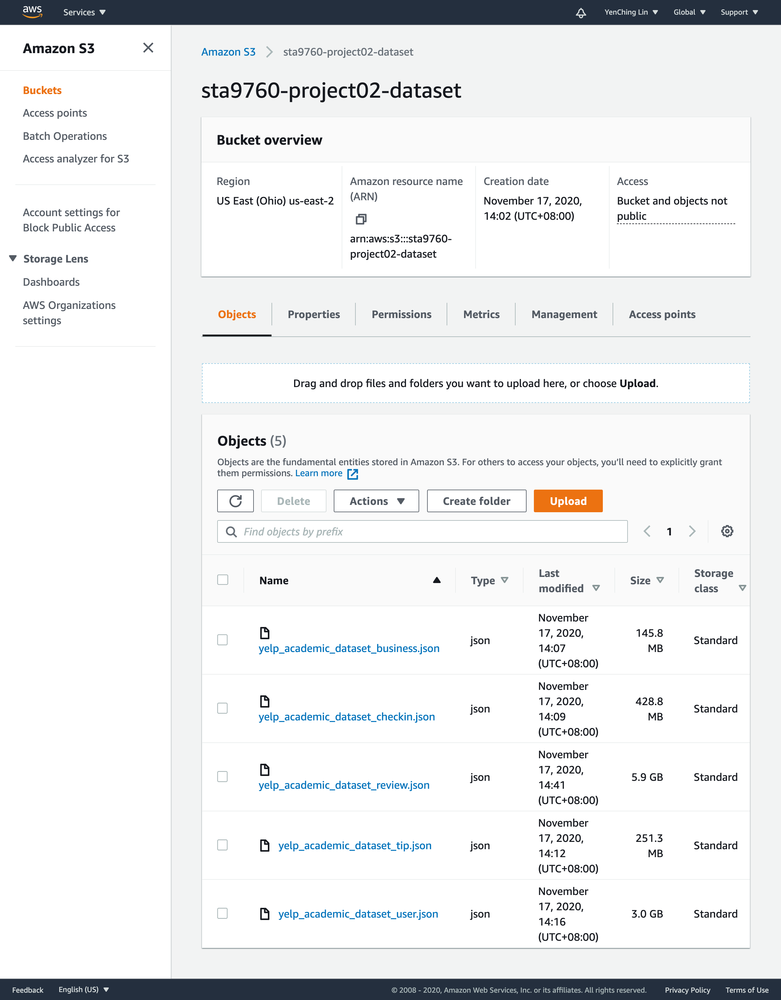
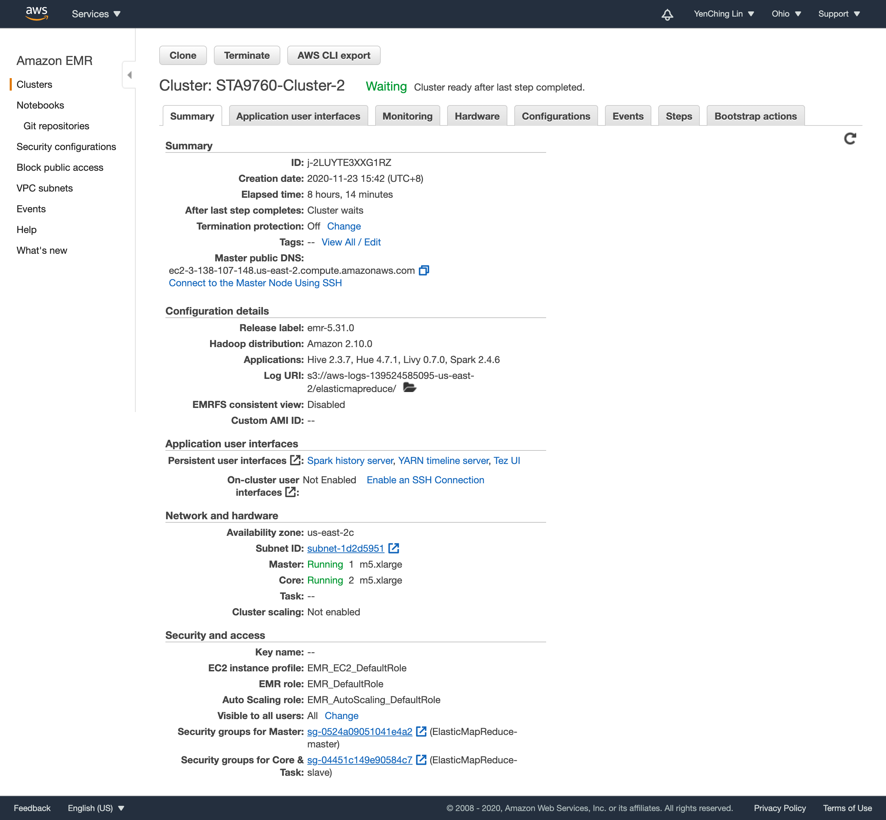
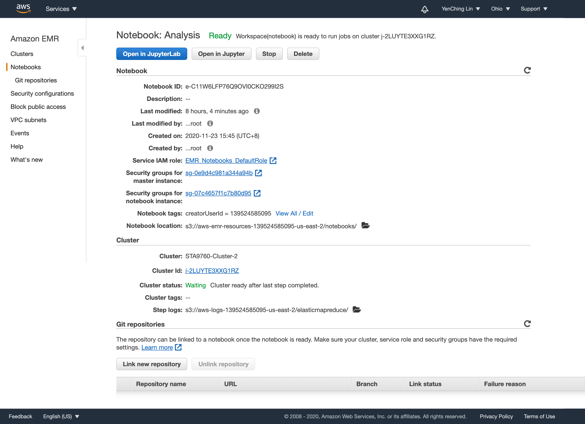
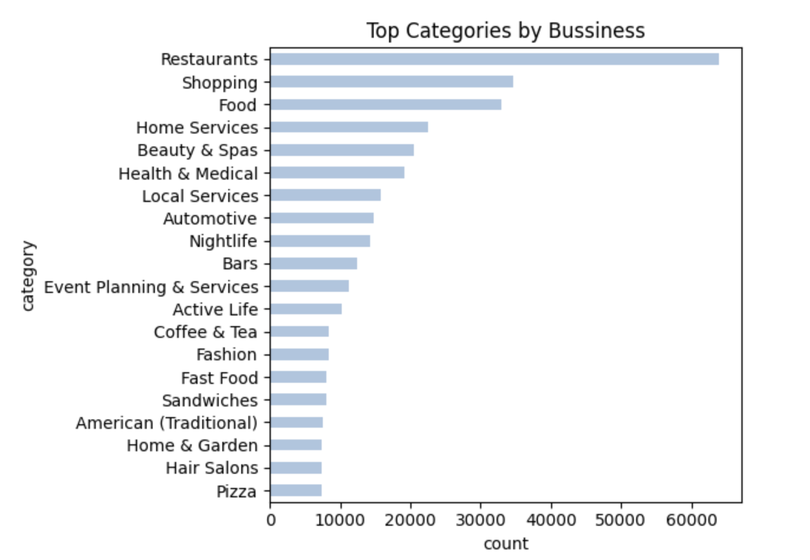
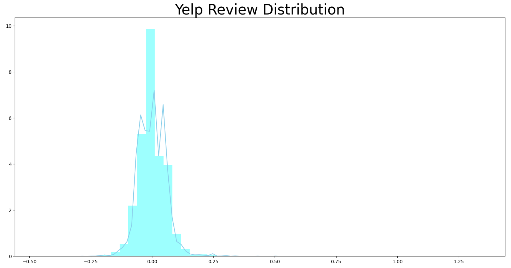
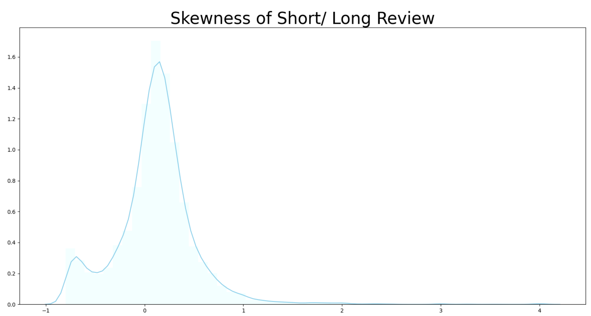
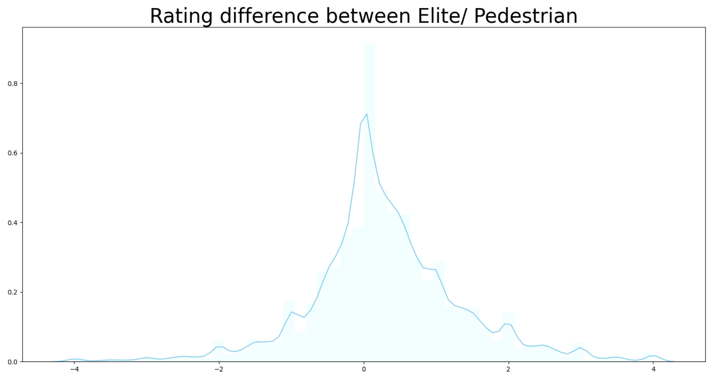

# Analyzing 10Gb of Yelp Reviews Data

											Yen-Ching, Lin

We will analyze a subset of Yelp's business, reviews and user data. This dataset comes from [Kaggle](https://www.kaggle.com/yelp-dataset/yelp-datasetalthough "Kaggle"). I have taken steps to pull this data into my s3 bucket: <s3://sta9760-project02-dataset/yelp_academic_dataset_business.json>


## Preparation
* Upload the 10GB Yelp dataset to AWS S3


* Create Cluster and Notebook in AWS EMR




## Installation and Initial Setup
* SparkSession
* pandas
* seaborn
* matplotlib

## Importing Data from S3
```
s3://{your_bucket_name}/{your_data_file_name}
```

## Overview of Data
```
df.printSchema()
```

## Analyzing Categories
### Association Table
Mapping a single business id multiple times to each distinct category:

Categories {id : [a, b, c]} --> Category {id : a, id: b, id: c}

business_id | category 
:----------:|:--------:
abcd123     | a,b,c

to

business_id | category 
:----------:|:--------:
abcd123     | a
abcd123     | b
abcd123     | c


* Total Unique Categories: 1336
* Top 20 Popular Categories


# Analysis

## Do Yelp Review Skew Negative?

Using the formula below to calculate the skewness:

###### *(['avg(stars)'] - ['stars']) / ['stars']*

We can obtain the yelp review distribution:



* Total number of review rating data: 8,021,122
* Total number of do review rating data: 209,393

### Conclusion 
From the graph above, the different between the average rating and the rating with written review seems to follow a noraml distribution, which might indicate that there is no skewness. Besides, the proportion of do review rating data is only about 2.5% of the toal number of data, we can ignore the effects that using the average star of all data in the deductions of fraction to calculate the skewness instead of the average star of data with no review. Therefore it's fair to say that the arguement that "only people who write a written review are those who are extremely dissatisfied or extremely satisfied with the service received" is not quite true.

### Further Discussion
We know that some reviewers might only leave a very short comment, such as "good", "excellent"...etc. So taking these rating of short reviews as do review rating may have bias.
Intead of using do review/ not do review rating, I divide the short review and long review by the length of text(>=50 or <50) and using the modified formula:
	
###### *(['avg(stars) with long review'] - ['avg(stars) with short review']) / ['avg(stars) with short review']*
	
 to make further examination.

* Total number of short review rating data: 7,740
* Total number of do review rating data: 209,393

The proportion of short review rating data of the toal number of data is very small , we can ignore the effects. I then exam the skew of short/long review rating.

Output:



The graph above shows that the skew is positive, we can interpret that to be: reviewers who left a short written response gave much higher rating than reviewers who left a long review on average.

## Should the Elite be Trusted?

Separating rating to two part: 

* Elite
* Pedestrian

Group       | Average Rating
:----------:|:--------------:
Elite       | 3.854
Pedestrian  | 3.688

* Average Rating Difference:



### Conclusion 
From the graph above, there are not much different between the average rating from elite and pedestrian. The avg.star from elite is slightly higher than from pedestrian. According to these two results, I think we can trust elite user although sometimes they might give a little higher rating than pedestrian. The possible reason for this slightly deviation is that some elite might have cooperation with the business, the rating is just a result of advertorial. Nonetheless, the deviation is acceptable for me. If someone really care about this deviation, they can lower the rating a bit from elite on themself.

## Other Analysis
* Effects on fans number per number of review/ useful review

Mean                   | Effect on Fans Number 
:---------------------:|:---------------------:
Per Number of review   | 0.0658
Per Useful Review      | 0.0366

### Conclusion 
From the results above, the fans number will increase 0.0658/ per number of review while the fans number will only increase 0.0366/per useful review. Thus, the user should focus on increasing the number of review rather than focus on the qulity of review if they want to efficiently increase the fans number.

